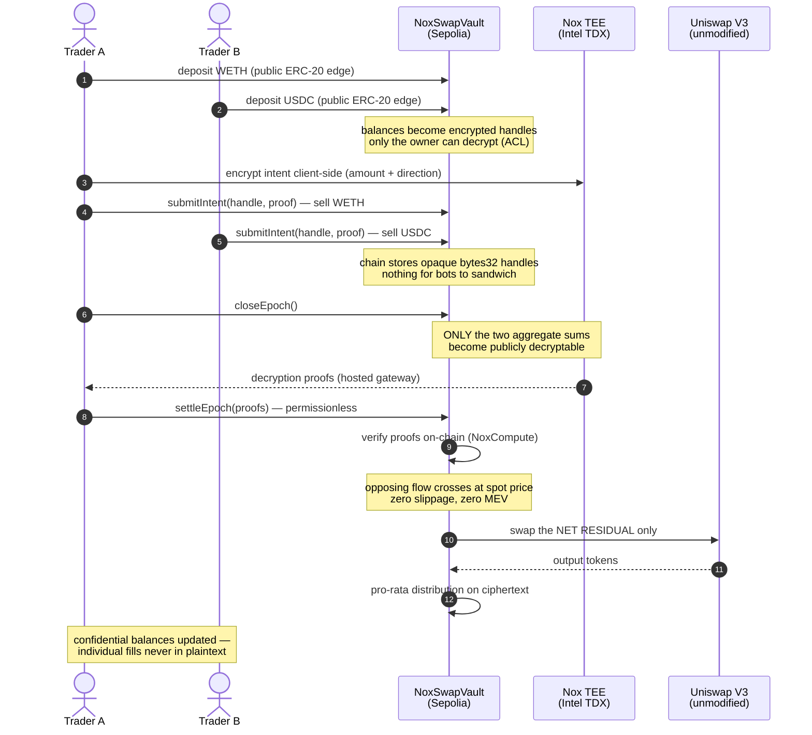

# NoxSwap — a dark pool over Uniswap, built on iExec Nox

**iExec WTF!! Hackathon Summer Edition submission.**

NoxSwap routes swaps through a confidential smart contract layer so that **no
on-chain observer learns who swapped, in which direction, or how much** — while
Uniswap itself stays completely unmodified.

- Users deposit a public token pair (WETH/USDC) into a shielded vault; their
  vault balances become **encrypted handles** (computed inside Intel TDX TEEs
  via [Nox](https://docs.noxprotocol.io)).
- Swap orders are **sealed intents**: amount *and* direction are encrypted
  client-side. The chain stores an opaque 32-byte handle.
- At the end of each epoch, **only the two aggregate sums** are made publicly
  decryptable. Opposing flow is **crossed internally at the pool's spot price**
  (zero slippage, zero MEV for the matched portion) and only the **net
  residual** is executed through the real Uniswap V3 router.
- Proceeds are distributed **pro-rata on ciphertext** — encrypted mul/div —
  so individual fills never appear in plaintext.
- Settlement is **permissionless and trustless**: anyone submits the gateway
  decryption proofs, and the contract verifies them on-chain via
  `Nox.publicDecrypt` (NoxCompute validates the proof) before touching Uniswap.
- **Selective disclosure**: `grantAuditorView` lets a user grant a specific
  auditor decryption rights over their balances via the Nox ACL — compliance
  without public exposure.

## Why

Public mempools and transparent AMM positions leak trading intent. That leak is
the root cause of sandwich MEV and strategy copy-trading, and it is a blocker
for discretion-sensitive institutional flow. Existing fixes either modify the
venue or fragment liquidity. NoxSwap adds privacy **as a layer**: batching +
TEE-backed encrypted computation on top of unmodified public infrastructure —
composability preserved.

## How an epoch works



## What the chain sees vs. what stays hidden

| Public | Hidden |
| --- | --- |
| Deposits/withdrawals at the ERC-20 edge | Balances inside the vault and how they evolve |
| One aggregate residual swap per epoch | Who participated, each intent's direction and size |
| The two aggregate epoch sums (at close) | Every individual intent, every individual fill |

## Repository layout

```
packages/nox-contracts   Solidity + Hardhat 3 + Nox toolchain
  contracts/NoxSwapVault.sol      the dark-pool vault
  contracts/test/MockUniswap.sol  local-test doubles (Sepolia uses real Uniswap)
  test/integration/noxswap.test.ts  end-to-end: encrypt → net → settle → decrypt
  scripts/deploy-sepolia.ts       Sepolia deployment against real Uniswap V3
packages/web             Next.js 14 + viem 2 + @iexec-nox/handle frontend
PRD.md                   product requirements document
feedback.md              iExec/Nox tooling feedback (hackathon deliverable)
```

## Run it

### Contracts (local end-to-end)

Requirements: Node 22+, Docker running (the Nox Hardhat plugin boots the local
TEE stack in containers).

```bash
cd packages/nox-contracts
npm install
npx hardhat compile
npx hardhat test test/integration/noxswap.test.ts
```

The test deposits from two wallets, submits **opposing sealed intents**
(100 WETH→USDC vs 40 USDC→WETH at a 1:1 test price), closes the epoch, fetches
the public-decryption proofs, settles — and asserts the router only ever saw
**60** (the residual), while both users' confidential balances land exactly
right.

### Deploy to Sepolia

```bash
cd packages/nox-contracts
SEPOLIA_RPC_URL=... PRIVATE_KEY=0x... npx hardhat run scripts/deploy-sepolia.ts --network sepolia
```

### Frontend

```bash
cd packages/web
npm install
NEXT_PUBLIC_VAULT_ADDRESS=0x... npm run dev
```

## Trust model (stated plainly)

Privacy rests on Intel TDX TEE guarantees plus Nox's on-chain ACLs; iExec has
operated confidential-computing infrastructure since 2017. The residual swap is
public by design — that is the composability trade-off. The anonymity set of an
epoch is its participant set: more intents per epoch, stronger privacy. The
demo uses `amountOutMinimum: 0` on the residual leg; a production version would
bound it with a TWAP check.

## Originality

Built during the WTF!! Hackathon Summer Edition. The repo was bootstrapped from
two public templates: Scaffold-ETH 2 (generic dapp monorepo — no Sablier/iExec
code) and the iExec `nox-hardhat-starter` (toolchain config + three example
contracts kept for reference). Everything NoxSwap-specific — the vault
contract, netting/settlement design, tests, deploy script, and the entire
frontend — was written during the hackathon. Not derived from any Vibe Coding
Hackathon project.
